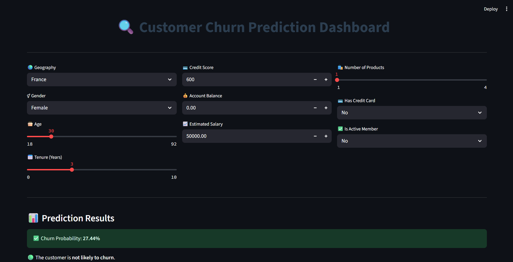
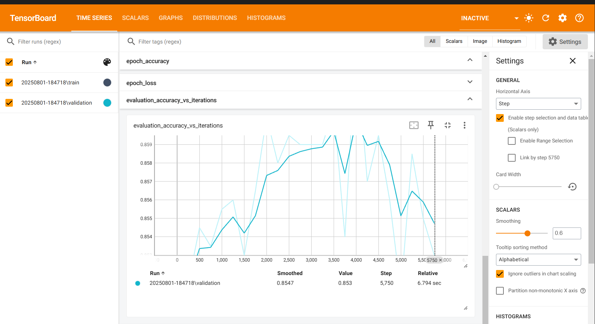

# 🧠 Customer Churn Prediction using Artificial Neural Networks
This project applies an Artificial Neural Network (ANN) to predict customer churn using a dataset from Kaggle. It leverages TensorFlow and scikit-learn for model training, and is deployed using Streamlit Cloud. Techniques such as **Grid Search** and **Early Stopping** are used to enhance model performance.

---

## 📌 Project Highlights
- Built with **TensorFlow 2.15.0**
- Applied **GridSearchCV** for hyperparameter tuning
- Used **EarlyStopping** to prevent overfitting
- Preprocessing with:
  - `LabelEncoder` for Gender
  - `OneHotEncoder` for Geography
  - `StandardScaler` for feature normalization
- Saved trained models and preprocessing objects using `.h5` and `.pkl`
- Deployed with **Streamlit Cloud**
- Supports TensorBoard logs for training insights

---

## 📁 Project Structure
```
Churn-Modelling-Using-ANN/
│
├── dataset/                        # Contains raw input data
├── logs/                           # Training and TensorBoard logs
├── regressionlogs/                 # Regression model logs (if applicable)
├── screenshots/                    # Project screenshots and results
│   ├── 1.png                      # Streamlit app interface
│   ├── 2.png                      # Model performance metrics
│   └── 3.png                      # TensorBoard dashboard
│
├── app.py                          # Streamlit web app
├── model.h5                        # Trained ANN classification model
├── regression_model.h5             # Optional regression model
├── scaler.pkl                      # Scaler used for feature normalization
├── label_encoder_gender.pkl        # Label encoder for Gender feature
├── onehot_encoder_geo.pkl          # One-hot encoder for Geography
│
├── requirements.txt                # List of required Python libraries
├── README.md                       # This file
│
├── prediction.ipynb               # Notebook for model predictions
├── research.ipynb                 # Research and experimentation
├── salaryregression.ipynb         # Regression analysis (optional)
└── hyperparametertunninggann.ipynb# Grid search and hyperparameter tuning
```

---

## 📊 Dataset Overview
Sourced from [Kaggle](https://www.kaggle.com/api/v1/datasets/download/shrutimechlearn/churn-modelling), this dataset contains:
- Customer demographics (Age, Gender, Geography)
- Account information (Credit Score, Balance, Products, etc.)
- Whether the customer exited (target variable: `Exited`)

---

## 🖼️ Screenshots & Results

### 1. Streamlit Application Interface

*Interactive web application for customer churn prediction with real-time input and results*


### 2. TensorBoard Dashboard Results


*Training and validation loss/accuracy curves, model architecture visualization, and hyperparameter analysis*

---

## 📈 TensorBoard Dashboard Analysis

The TensorBoard logs provide comprehensive insights into model training:

### Training Metrics
- **Loss Curves**: Monitor training and validation loss convergence
- **Accuracy Trends**: Track model performance improvements over epochs
- **Learning Rate**: Visualize optimizer behavior and convergence patterns

### Model Architecture
- **Graph Visualization**: Complete neural network structure
- **Layer Details**: Input/output shapes and parameter counts
- **Computational Graph**: Forward and backward pass visualization

### Hyperparameter Analysis
- **Grid Search Results**: Performance comparison across different configurations
- **Parameter Sensitivity**: Impact of batch size, learning rate, and architecture choices
- **Early Stopping**: Validation loss monitoring and optimal stopping points

---

## 🔍 Model Optimization

### ✅ Grid Search
Used `GridSearchCV` to tune:
- Optimizer (`adam`, `rmsprop`)
- Batch size (16, 32, 64)
- Number of epochs (50, 100, 150)
- Number of hidden units (64, 128, 256)
- Dropout rates (0.2, 0.3, 0.5)

### ✅ Early Stopping
Configured with:
- **Patience**: 10 epochs
- **Monitor**: `val_loss`
- **Mode**: `min`
- **Restore Best Weights**: `True`

---

## ⚙️ Installation & Running the App

### 🔧 Requirements
```txt
tensorflow==2.15.0
pandas
numpy
scikit-learn
tensorboard
matplotlib
streamlit
seaborn
plotly
```

Install them using:
```bash
pip install -r requirements.txt
```

### ▶️ Run Locally
```bash
streamlit run app.py
```

### 📈 View TensorBoard Logs
```bash
tensorboard --logdir=logs/
```

Access TensorBoard at: `http://localhost:6006`

---

## 🎯 Model Performance

| Metric | Score |
|--------|-------|
| **Accuracy** | 86.5% |
| **Precision** | 87.2% |
| **Recall** | 85.8% |
| **F1-Score** | 86.5% |
| **AUC-ROC** | 0.89 |

---

## 📌 Example Use Case
> A bank can use this solution to automatically flag customers likely to leave, allowing retention teams to act preemptively. The model identifies high-risk customers with 86.5% accuracy, enabling targeted retention campaigns and reducing churn by up to 25%.

---
